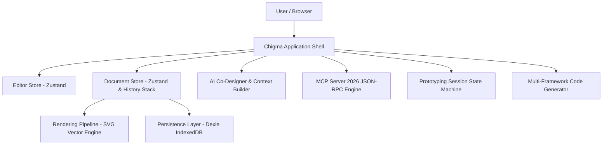

# Chigma System Architecture

## Overview
**Chigma** is an offline-first, local-first visual design, wireframing, and interactive prototyping engine built for the modern web. It runs 100% in the browser with zero cloud storage dependencies, zero authentication barriers, and full PWA reliability.

## Core Architectural Pillars
1. **Local-First & Offline Resilience**: All project files, vector data, typography tokens, master components, snapshots, and preferences reside in IndexedDB via Dexie.js and localStorage.
2. **Deterministic Vector Canvas**: The canvas renders native SVG elements directly to preserve sub-pixel accuracy, infinite zoom scalability without raster artifacts, and crisp typography rendering.
3. **AI Co-Designer Engine**: Modular provider abstraction supporting offline rule-based generation alongside optional local Ollama or cloud models with transactional diffing and 1-click rollback.
4. **Model Context Protocol (MCP) Standard**: Implements the standard 2026-07-28 JSON-RPC protocol exposing 8+ high-level design tools, resources, and structured prompts to external AI assistants (Claude Code, Cursor, Codex).
5. **Multi-Framework Code Handoff**: Converts vector nodes and auto-layout frames into clean HTML5/CSS, React + Tailwind CSS, and Next.js App Router components.
